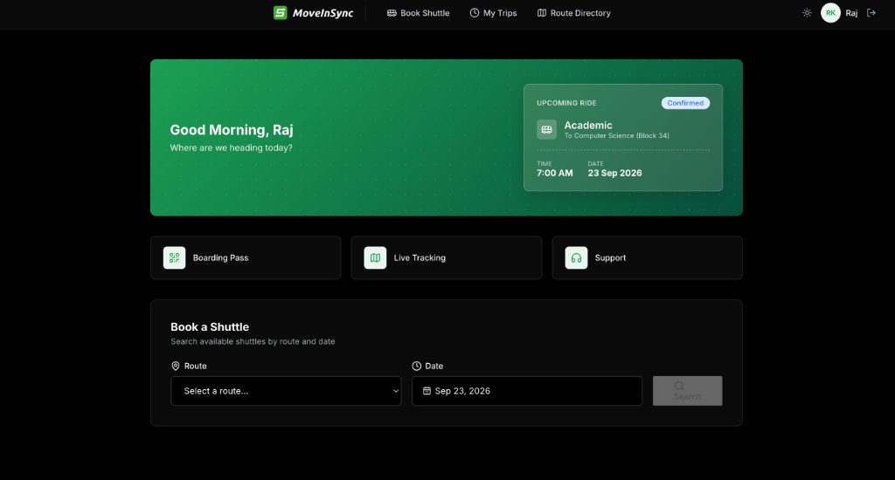
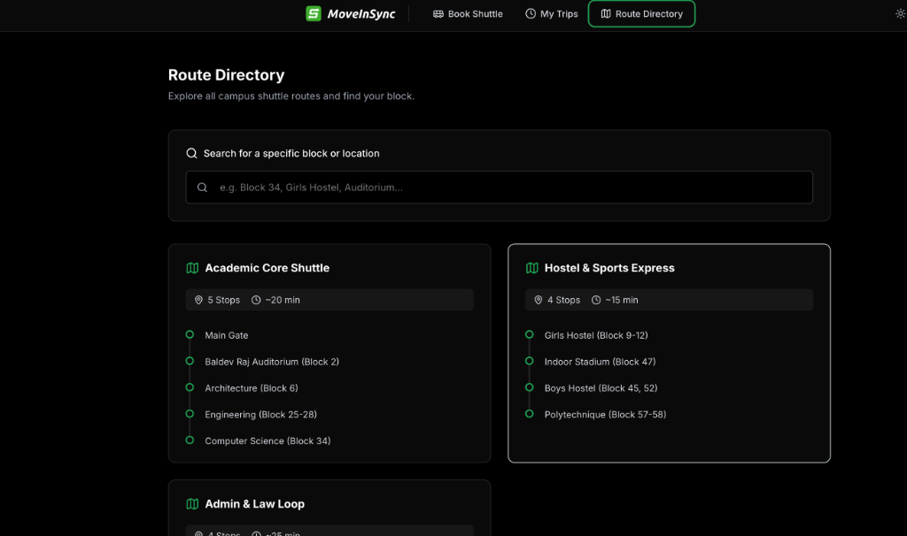
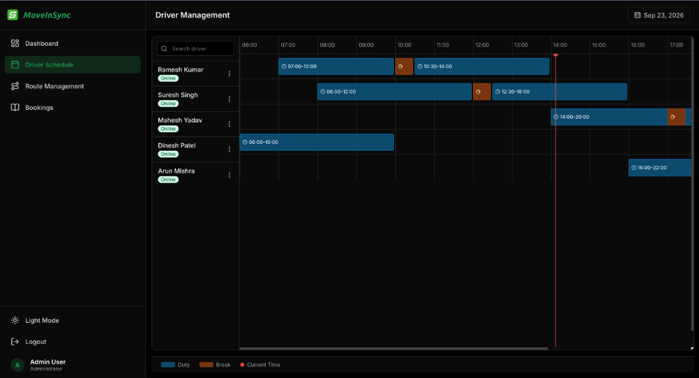
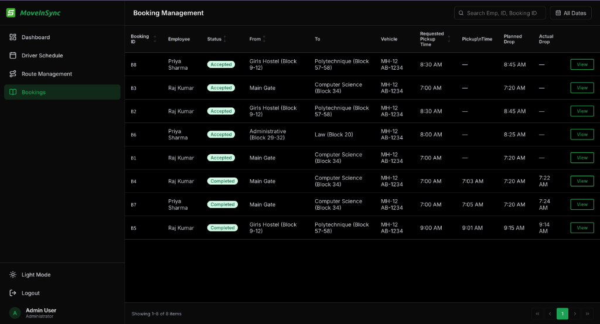
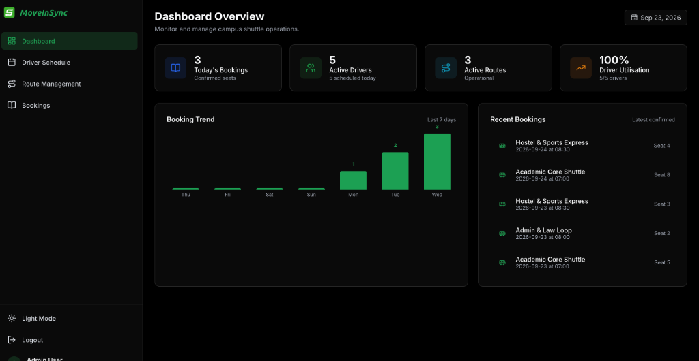

# MoveInSync — Smart Campus Shuttle Management System

A full-featured, production-quality **Shuttle Management System** built with React + Vite for LPU campus. Covers shuttle booking, trip history, driver scheduling with conflict detection, route management, and an admin analytics dashboard — all with a premium, animated UI and zero backend dependencies (mock data layer is API-swap ready).

---

## 🚀 Quick Start

### Prerequisites
- Node.js v16 or higher
- npm

### Setup & Run

```bash
# 1. Install dependencies
npm install

# 2. Start development server
npm run dev
# → http://localhost:5173

# 3. Production build
npm run build
```

---

## 🔐 Demo Credentials

| Role | Email | Password |
|---|---|---|
| **Student** | `student@lpu.in` | `password` |
| **Admin** | `admin@lpu.in` | `admin123` |

> You can also register a new student account directly from the Register page.

---

## ✅ Feature Checklist (vs. Requirements)

### I. Shuttle Booking Management
| Requirement | Status | Where |
|---|---|---|
| Students can book shuttle rides | ✅ | `/student/book` |
| Search trips by route + date | ✅ | Book Shuttle → search form |
| Real-time seat occupancy display | ✅ | Occupancy heat bars per trip card |
| Admins can view all bookings | ✅ | `/admin/bookings` |
| Admins can cancel bookings | ✅ | Booking detail panel |
| Trip history for users | ✅ | `/student/history` |
| Past trip details (date, time, route) | ✅ | Trip History page — Upcoming / Past tabs |

### II. Driver Availability Management
| Requirement | Status | Where |
|---|---|---|
| Visual timeline of driver availability | ✅ | `/admin/drivers` — CSS Grid timeline |
| Per-driver daily schedule view | ✅ | Each driver has a horizontal timeline row |
| Add DUTY / BREAK shift blocks | ✅ | Click driver row → Add Shift modal |
| Edit existing shift | ✅ | Click shift block → Edit modal |
| Delete shift | ✅ | Edit modal → Delete button |
| Conflict detection (no overlapping shifts) | ✅ | `useShifts.validateShift()` — throws descriptive error |
| Navigate between dates | ✅ | Prev / Next date arrows + DatePicker |
| Real-time "now" indicator | ✅ | Red vertical line on current time |

### III. Admin Functionalities
| Requirement | Status | Where |
|---|---|---|
| Define shuttle routes | ✅ | `/admin/routes` — Route Management |
| Add / remove stops | ✅ | Route builder drawer |
| Reorder stops | ✅ | Up/Down controls per stop |
| Toggle route active/inactive | ✅ | Toggle switch per route |
| Dashboard KPI summary | ✅ | `/admin/dashboard` |
| 7-day booking trend chart | ✅ | Custom CSS bar chart (no library) |
| Monitor bookings by date | ✅ | Dashboard date picker |
| Sortable booking table | ✅ | Click column headers to sort |
| Filter bookings | ✅ | Search + date + status filters |
| Paginated results | ✅ | 10 rows/page with full pagination controls |

### IV. Student Portal
| Requirement | Status | Where |
|---|---|---|
| Route Directory — find block by route | ✅ | `/student/routes` |
| Search by block number or building | ✅ | Live search with stop highlighting |
| Dark / Light theme | ✅ | Toggle in navbar |
| Persistent login session | ✅ | `localStorage` with password stripped |

---

## 🏗 Architecture

```
src/
├── context/          # Global state (Auth, Bookings, Toasts)
├── hooks/            # Data layer (useRoutes, useTrips, useShifts, useDrivers)
│   └── *.js          # Each hook: swap fetch() for mock — zero component changes
├── pages/
│   ├── admin/        # Dashboard, Bookings, Drivers, Routes
│   └── student/      # Book Shuttle, Trip History, Route Directory
├── components/
│   ├── common/       # Button, Badge, Modal, DatePicker, Skeleton, EmptyState
│   └── layout/       # AdminLayout, StudentLayout, Sidebar, Navbar
├── mock/             # JSON/JS data files (routes, trips, bookings, drivers, shifts)
├── router/           # AppRouter with lazy-loaded route chunks
└── utils/            # dateUtils, timelineUtils (pixel math, overlap detection)
```

### Key Design Decisions

1. **API-ready data layer** — Every custom hook has a comment: *"Swap internals with fetch() calls when real API is ready."* The component layer never knows whether data comes from mock or network.

2. **Code splitting** — `React.lazy()` + `Suspense` splits each page into its own JS chunk. Students never download admin code; admins get page chunks on demand. Initial load is ~133 KB gzip (vs 172 KB monolithic).

3. **CSS Modules** — All styles are scoped and statically extracted at build time. Zero runtime style injection.

4. **Immutable state patterns** — All hooks use `store.map(...)` / spread for updates. No direct mutation. Enables easy debugging and future Redux/Zustand migration.

---

## ⚙️ Complexity Analysis

### Time Complexity

| Operation | Complexity | Notes |
|---|---|---|
| Trip search (route + date) | O(n) | Linear scan of trip store |
| Seat reservation / release | O(n) | Single-pass array map |
| Shift conflict detection | O(k) | k = shifts per driver per day ≈ 3–5 (effectively O(1)) |
| Booking filter + sort | O(n log n) | Combined filter then sort |
| Dashboard 7-day trend | O(n) | `useMemo`-cached; 7 fixed iterations × n bookings |
| Route directory search | O(r × s) | r = routes (4), s = stops (≤6); sub-millisecond |

### Space Complexity
All in-memory stores are **O(n)** where n = number of entities. Data is never duplicated — cross-references use `id` foreign keys. Pagination ensures DOM node count is always capped at 10.

### Performance Optimizations
- `useCallback` on every data function → prevents re-renders
- `useMemo` on the booking trend computation
- Pagination (10 rows) → DOM render is O(1) regardless of dataset
- `framer-motion` uses GPU-composited transforms only

---

## 🛠 Tech Stack

| Tool | Purpose |
|---|---|
| **React 18** | UI framework |
| **Vite** | Build tool + HMR |
| **React Router v6** | Client-side routing with nested layouts |
| **framer-motion** | Page transitions, stagger animations, layout animations |
| **Lucide React** | Icon set |
| **date-fns** | Date arithmetic |
| **CSS Modules** | Scoped, zero-runtime styling |

---

## 🎨 UI Highlights

- **Glassmorphism-inspired cards** with subtle shadows and border gradients
- **Premium dark mode** with full CSS variable theming
- **Staggered entrance animations** — cards animate in sequentially on page load
- **Driver timeline** — CSS Grid pixel-perfect layout with a live "now" red line
- **Toast notification system** — 4 types (success, error, warning, info) with slide-in animation
- **Auto-scroll** to search results after booking search
- **Skeleton loaders** for async-simulated data fetching
- **Empty states** for every filtered/empty list

---

## 📸 Screenshots

### Student Portal — Book Shuttle


### Student Portal — Route Directory


### Admin Portal — Driver Schedule Timeline


### Admin Portal — Booking Management


### Admin Portal — Dashboard Overview


---

## 📁 Submission Notes

- **Framework:** React 18 + Vite ✅ (plus point per requirements)
- **Mock data:** Used throughout (`/src/mock/`) ✅
- **Comments:** All hooks, utilities, and complex algorithms are documented ✅
- **Code splitting:** `React.lazy()` per route for production performance ✅
- **Error handling:** All mutations validate before executing; errors surface as typed toasts ✅

